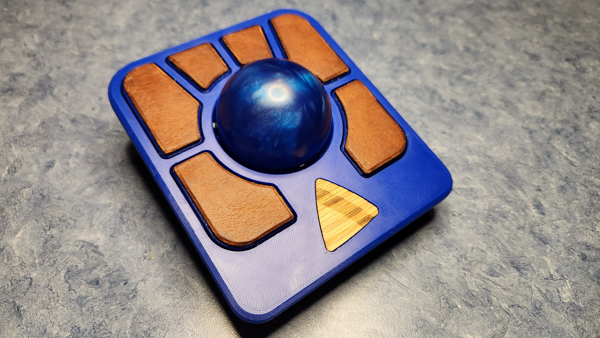
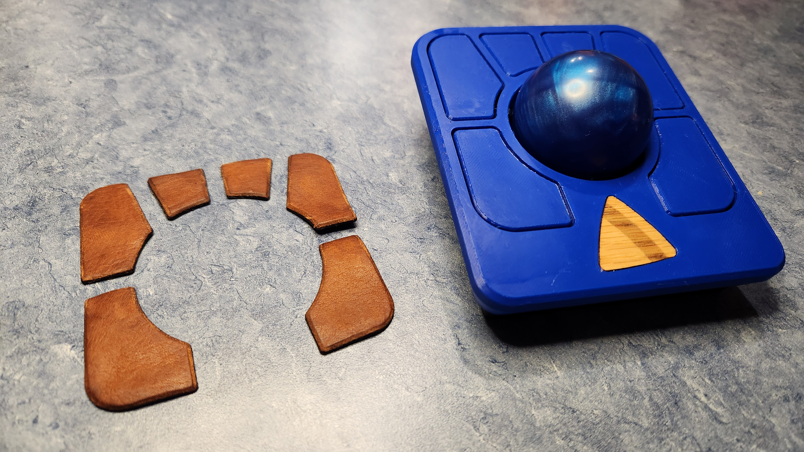

# Ploopy-Adept-Leather
Vector files for use with laser engravers or CNC machines.

### The Files

The `adept_buttons_vector_outline.dxf` file can be imported into your laser or CNC software (LightBurn, etc) like any other vector art. Button shpaes should import at the correct size for the standard Ploopy Adept.

The `adept_body_surface_vector_outline.dxf` file can be used in the same way as the buttons file above, but it will cut the shape for the rest of the top surface, NOT including the buttons. Note that it does not include a cut for the ploopy logo.

### Post Processing

If cutting leather you can do the usual post-processing. I beveled the edges and brunished with wax before using Barge cement to secure the leather to the buttons. I also detached the bottom plate and PCB before applying pressure to the leather during the gluing process as to not risk pressing too hard on the circuit board buttons.

### Finished Look

### Process

<video controls src="media/20250518_173405.mp4" title="Title"></video>

